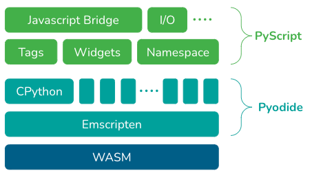

# **PyScript**

<style>
  :root {
    --color-background: #FFFFFF;
    --color-foreground: #58595b;
    --color-highlight: #f58220;
    --color-dimmed: #888;
  }
</style>

Ordina Pythoneersday

https://github.com/raviselker/pythoneersday-pyscript

---

# PyCon 2022

Peter Wang (keynote) **PyScript - Programming for Everyone**


---

# How?



---

# Very Alpha

> Please be advised that PyScript is very alpha and under heavy development. There are many known issues, from usability to loading times, and you should expect things to change often. We encourage people to play and explore with PyScript, but at this time we do not recommend using it for production.

---

# Hello World

```html
<!DOCTYPE html>
<html lang="en">
<head>
  <meta charset="utf-8">
  <meta name="viewport" content="width=device-width, initial-scale=1">
  <title>Hello, World!</title>
  <link rel="stylesheet" href="https://pyscript.net/alpha/pyscript.css"/>
  <script defer src="https://pyscript.net/alpha/pyscript.js"></script>
</head>
<body>
  <py-script>print("Hello, World!")</py-script>
</body>
</html>
```

---

# Python REPL

```html
<!DOCTYPE html>
<html lang="en">
<head>
  <meta charset="utf-8">
  <meta name="viewport" content="width=device-width, initial-scale=1">
  <title>Python REPL</title>
  <link rel="stylesheet" href="https://pyscript.net/alpha/pyscript.css"/>
  <script defer src="https://pyscript.net/alpha/pyscript.js"></script>
</head>
<body>
  <py-repl></py-repl>
</body>
</html>
```

---

# Interacting with DOM

```html
<body>
  <div id="output">Original text</div>
  <py-script>
    output_el = Element("output")
    output_el.write("I can add some random text to the element!")
  </py-script>
</body>
```

---

# Interacting with DOM through js

```html
<body>
  <div id="output">Original text</div>
  <py-script>
    from js import console, document

    output_el = document.querySelector("#output")
    
    console.log("Changing ouput element...")
    output_el.style.backgroundColor = "#f58220"
    output_el.style.color = "#FFF"
    output_el.innerHTML = "Ordina Pythoneersday | Pyscript"
  </py-script>
</body>
```

---

# Loading python package

```html
<py-config type="json">
  {
    "packages": ["matplotlib"]   
  }
</py-config>
<div id="output"></div>
<py-script>
  import matplotlib.pyplot as plt

  output_el = Element("output")
  fig, _ = plt.subplots()
  output_el.write(fig)
</py-script>
```

---


# Let's explore PyScript!

https://github.com/raviselker/pythoneersday-pyscript
